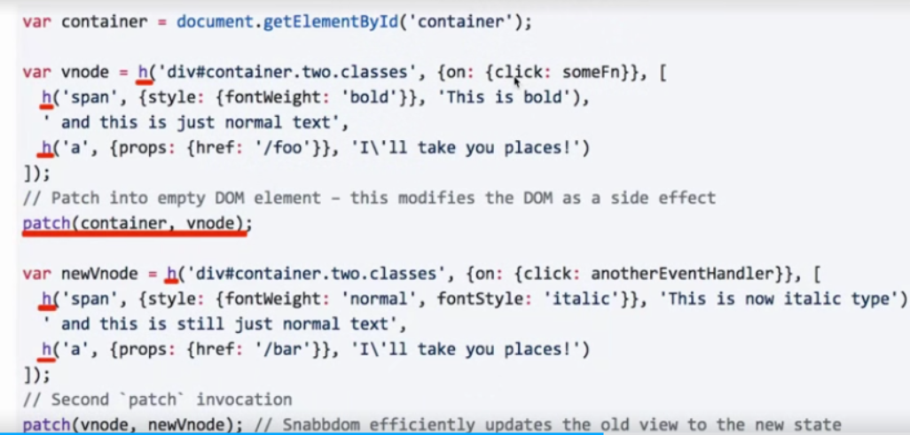
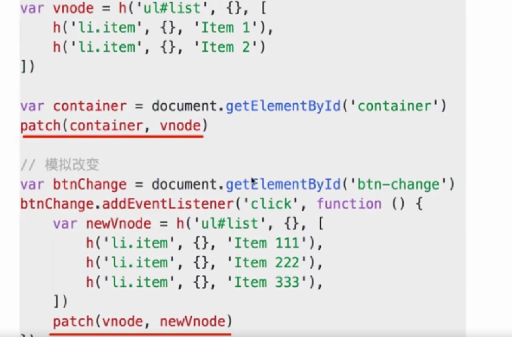
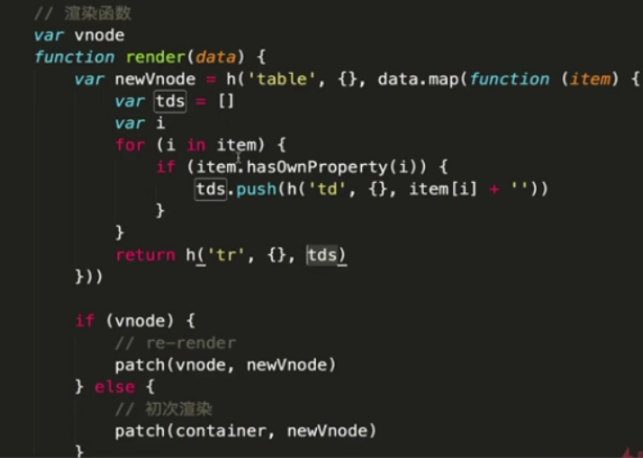
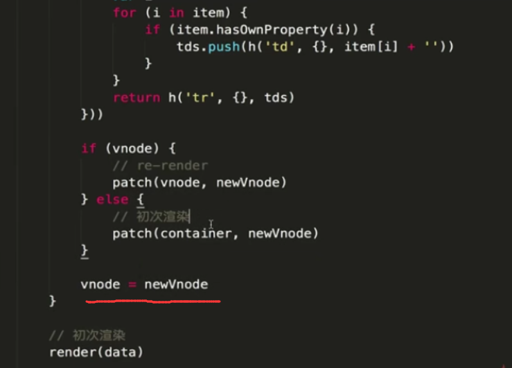
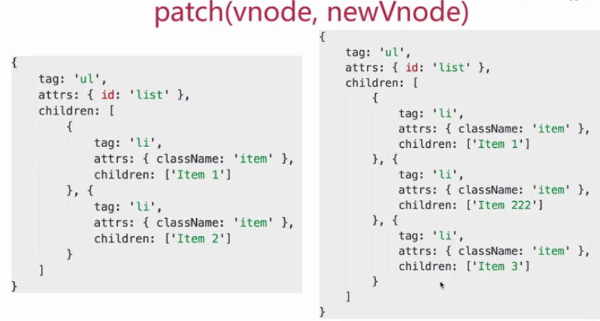
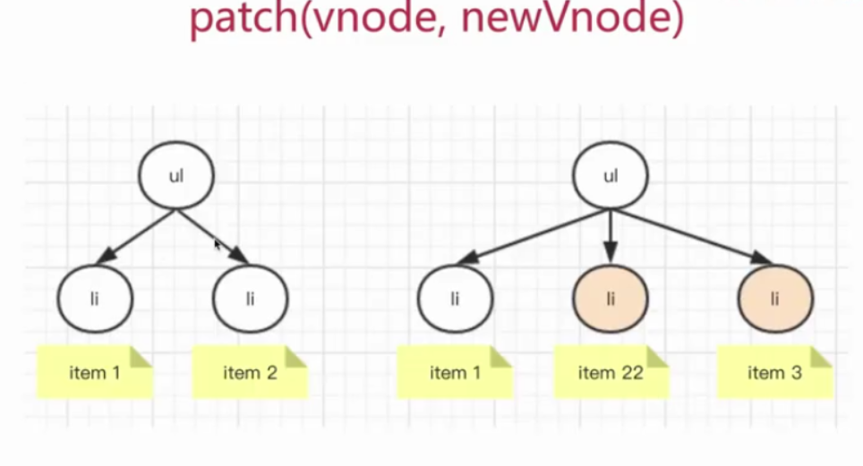

# 问题

## vdom 是什么？为何会存在 vdom

- 什么是 vdom

  - virtual dom ，虚拟 dom
  - 用 js 模拟 dom 结构
  - 将 dom 变化的对比操作，放在 js 层来做，提高效率（图灵完备语言）
  - 目的是提高重绘性能（目前浏览器处理 js 速度很快，但 dom 操作却是很昂贵的）

    一段 html,真实的 dom 结构

    ```
    <ul id="list">
        <li class="item">Item 1</li>
        <li class="item">Item 2</li>
    </ul>

    ```

    用 js 模拟得出：

    ```

    {
        tag:'ul',
        attrs:{
            id:'list'
        },
        children:[
            {
                tag:'li',
                attrs:{className:'item'},
                children:['Item 1']
            },{
                tag:'li',
                attrs:{className:'item'},
                children:['Item 2']
            }
        ]
    }

    ```

- 设计一个需求场景

  ```
  // 1.将该数据展示成一个表格。
  // 2.随便修改一个信息，表格也跟着修改
  [
      {
          name:'zs',
          age:'20',
          address:'beijing'
      },
      {
          name:'ls',
          age:'21',
          address:'shanghai'
      },
      {
          name:'ww',
          age:'22',
          address:'guangzhou'
      }

  ]
  ```

- 用 jQuery 实现以上需求
  ```
  <div id="container"></div>
  <button id="btn-change">change</button>
  <script type="text/javascript" src="./jquery.js"></script>
  <script type="text/javascript">
    var data = [
      {
          name:'zs',
          age:'20',
          address:'beijing'
      },
      {
          name:'ls',
          age:'21',
          address:'shanghai'
      },
      {
          name:'ww',
          age:'22',
          address:'guangzhou'
      }
    ]
    // 渲染函数
    function render(data) {
        var $container = $("container")
        // 清空
        $container.html('')
        // 拼接table
        var $table = $('<table>')
        $table.append($('<tr><td>name</td><td>age</td><td>address</td></tr>'))
        data.forEach(function(item){
            $table.append($(`<tr><td>${item.name}</td><td>${item.age}</td><td>${item.address}</td></tr>`))
        })
        // 一次性渲染到页面
        $container.append($table)
    }
    // 修改信息
    $("#btn-change").click(function(){
        data[1].age = 30
        data[2].address = "深圳"
        render(data)
    })
    // 初始化时候渲染
    render(data)
  </script>
  ```
- 遇到的问题
  - dom 操作是‘昂贵’的，js 运行效率极高
  - 尽量减少 dom 操作，而不是‘清空重来’
  - 项目越复杂，影响就越严重
  - vdom 可以解决这些问题

## vdom 如何应用，核心 API 是什么

> 如何使用？可用 snabbdom 的用法来举例，核心 API:h 函数、patch 函数

- 介绍 snabbdom(实现 vdom 的一个库)
  
  
  
- 重做之前的 demo

  ```
  // 引入snabbdom库
  <script type="text/javascript">
    var snabbdom = window.snabbdom;
    // 定义patch
    var patch = snabbdom.init([
        snabbdom_class,
        snabbdom_props,
        snabbdom_style,
        snabbdom_eventlisteners
    ])
    // 定义h
    var h = snabbdom.h
    var container = document.getElementById("container")
    // 生成vnode
    var vnode = h("ul#list",{}, [
        h('li.item',{},'Item 1'),
        h('li.item',{},'Item 2')
    ])
    patch(container,vnode)
    document.getElementById('btn-change').addEventListener('click',function(){
        // 生成newVnode
        var vnode = h("ul#list",{}, [
            h('li.item',{},'Item 1'), // 浏览器中测试可以看到Item 1这个li节点没有变过
            h('li.item',{},'Item B'),
            h('li.item',{},'Item 3')
        ])
        patch(vnode,newVnode) // 对比出哪些需要更新哪些不需要更新，只更新需要更新的
    })
  </script>

  ```

  之前渲染 table 的方法可以使用此方法重写
  
  

- 核心 API
  h 函数、patch 函数

## 介绍一下 diff 算法

- 什么是 diff 算法
  > 是 linux 的基础命令，vdom 中应用 diff 算法是为了找出需要更新的节点；diff 实现，patch(container，vnode)、patch（vnode,newVnode）；核心逻辑，createElement 和 updateChildren
- 去繁就简
- vdom 为何用 diff 算法
  > dom 操作是昂贵的，因此尽量减少 dom 操作，找出本次 dom 必须更新的节点来更新，其他的不更新，这个找出的过程就需要 diff 算法
- diff 算法的实现流程

  
  
  
  
  

- 不仅仅是以上内容，还有:
  - 节点新增和删除
  - 节点重新排序
  - 节点属性、样式、事件绑定
  - 如何极致压榨性能
  - 。。。更多
