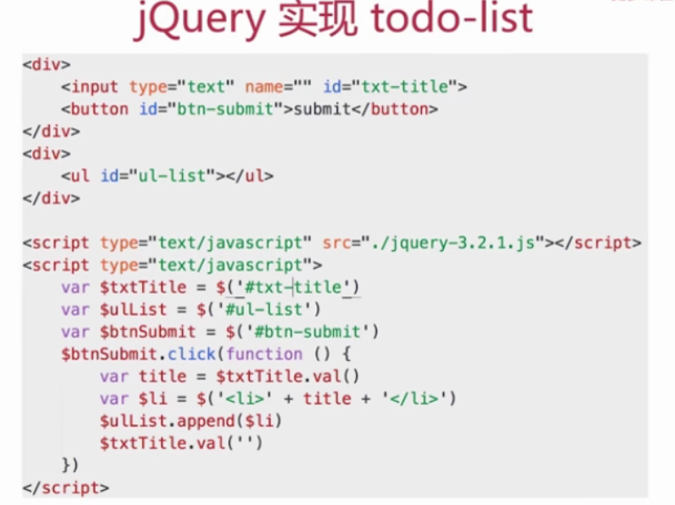
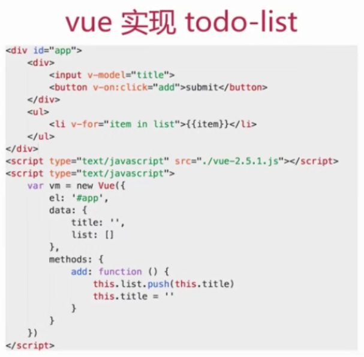
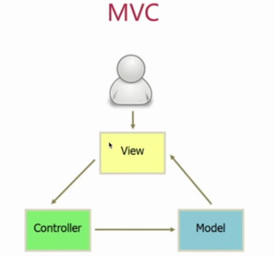
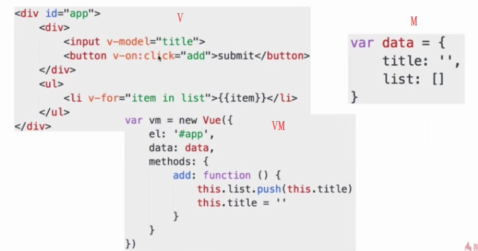
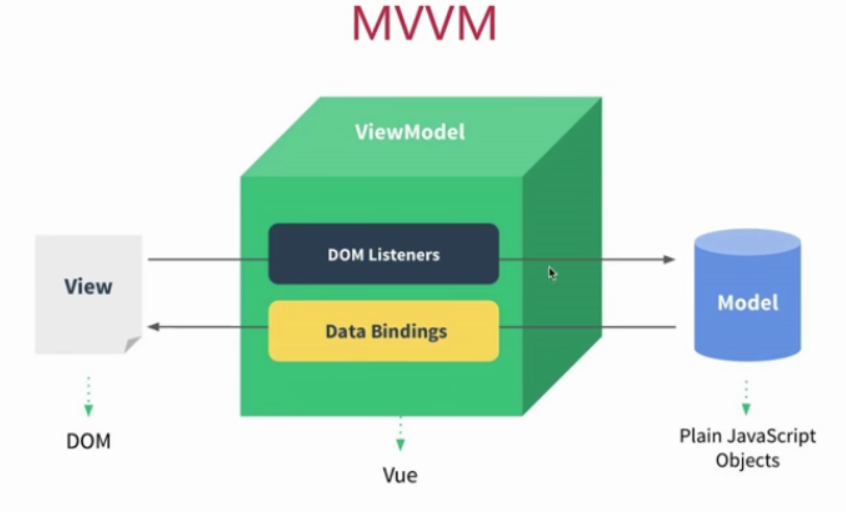

# 如何理解 MVVM

# 如何实现 MVVM

# 是否解读过 vue 的源码

# 说一下使用 jQuery 和使用框架的区别

- 使用 jQuery 实现一个 todo-list
  
- vue 实现 todo-list
  
- jQuery 和框架的区别
  1. 数据和视图的分离，解耦（契合开放封闭原则）
  2. 以数据驱动视图，只关心数据变化，DOM 操作被封装

# 说一下对 MVVM 的理解

- MVC
  > 三者分开、解耦
  - M - Model 数据
  - V - View 视图、界面
  - C - Controller 控制器、逻辑处理
    
- MVVM

  > 所谓 MVVM,即 Model View ViewModel

  - Model-模型、数据
  - View - 视图、模板（视图和模型是分离的）
  - ViewModel - 连接 Model 和 View

  

  > view 通过事件绑定操作 model，model 通过数据绑定操作 view，如下图：

  

- 关于 ViewModel
  - MVVM 不算是一种创新
  - 但其中的 ViewModel 确实是一种创新
  - 真正结合前端场景应用的创建

# MVVM 框架的三大要素（即 vue 的三要素）

1. 响应式： vue 如何监听到 data 的每个属性变化？
2. 模板解析引擎：vue 的模板如何被解析，指令如何处理？
3. 渲染：vue 的模板如何被渲染成 html?以及渲染过程

# vue 中如何实现响应式

- 什么是响应式

  > 修改 data 属性之后，vue 立刻监听到；data 属性被代理到 vm 上

- Object.defineProperty(实现响应式的核心 API)
  ```
  var obj = {}
  var _name = 'zs'
  Object.defineProperty(obj,"name",{
      get:function(){
          console.log('get',_name)
          return _name
      },
      set:function(newVal){
          console.log('set',newVal)
          _name = newVal
      }
  })
  console.log(obj.name) // zs
  obj.name='ls'
  // console.log(obj.name) // ls
  ```
- 模拟

  ```
  <!-- var vm=new Vue({
      el:'#app',
      data:{
          name:'zs',
          age:20
      }
  }) -->
  var vm = {}
  var data = {
      name:'zs',
      age:20
  }
  var key,value
  for(key in data){
      (function(key){
          // 通过defineProperty将data的属性代理到vm上
          Object.defineProperty(vm,key,{
              get:function(){
                  console.log('get',data[key]) // 监听
                  return data[key]
              },
              set:function(newVal){
                  console.log('set',newVal) // 监听
                  data[key] = newVal
              }
          })
      })(key)
  }
  ```

# vue 中如何解析模板

- 模板是什么
  - 本质：字符串
  - 有逻辑，如 v-if v-for 等
  - 与 html 格式很像，但有很大区别
  - 最终还要转换为 html 来显示
  - 模板最终必须转换成 JS 代码，因为：
    - 有逻辑（v-if v-for），必须用 JS 才能实现
    - 转换为 html 渲染页面，必须用 js 才能实现
    - 因此，模板最终要转换成一个 JS 函数（render 函数）
  - 下面代码片段就是一个模板
    ```
    <div id="app">
            <div>
                <input v-model="title">
                <button v-on:click="add">submit</button>
            </div>
            <ul>
                <li v-for="item in list">{{item}}</li>
            </ul>
    </div>
    ```
- render 函数

  - with 的用法（vue 中有使用 with，日常开发避免使用 with）

    ```
    var obj = {
        name:'zs',
        age:20,
        getAddress:function(){
            alert('bj')
        }
    }
    //  不使用with
    function fn () {
        alert(obj.name)
        alert(obj.age)
        obj.getAddress()
    }
    // 使用with
    function fn1() {
        with(obj){
            alert(name)
            alert(age)
            getAddress()
        }
    }
    ```

  - render 函数示例
    ```
    // 部分vue代码
    <div id="app">
        <p>{{price}}</p>
    </div>
    <script src="./vue-2.5.9.js"></script>
    <script>
        var vm = new Vue({
            el:"#app",
            data:{
                price: 100
            }
        })
    </script>
    // 其中的模板部分代码会由render函数进行解析,render函数核心代码如下
    funtion render() {
        with(this){
            // this指vm
            return _c(
                'div',
                {
                    attrs:{"id":"app"}
                },
                [
                    _c('p',[_v(_s(price))])
                ]
            )
        }
    }
    // 以上函数相当于以下：
    function render1() {
        return vm._c(
            'div',
            {
                attrs:{'id','app'}
            },
            [
                vm._c('p',[vm._v(vm._s(vm.price))])
            ]
        )
    }
    // 模板中所有信息都包含在了render函数中，this即vm，price即this.price；即data中的price；_c即this._c即vm._c
    ```

- 从哪里可以看到 render 函数？
- 复杂一点的例子，render 函数是什么样子？
- v-if v-for v-on 都是怎么处理的？
  ```
   // 看一下todo-list demo的render函数
   // 在vue源码中搜索code.render，在恰当位置打印出code.render，
   // 然后运行代码todo-list demo，即可看到打印出的解析todo-list demo模板的render函数
   // vue2.0开始支持预编译，开发环境写模板，经过编译打包，得到生产环境的js
  ```
  [JavaScript 中的表单事件](https://www.cnblogs.com/yaogengzhu/p/10801021.html)
- 上面解决了模板中“逻辑”（v-for v-if）的问题
- 还剩下模板生成 html 的问题
- 另外，vm.\_c 是什么？render 函数返回了什么？
  > 要回答上面的问题，先回顾一下 vdom 的知识点，vdom 中的 h 函数和 vue 中的\_c 函数核心原理基本相同 ；\_c 函数和 h 函数一样，返回的都是 vnode，vm.\_c 其实就相当于 snabbdom 中的 h 函数，render 函数执行之后，返回的是 vnode。
- render 函数与 vdom
  ```
  function updateComponent() {
      // vm._render 即上面的render函数，返回vnode
      vm._update(vm._render())
  }
  vm._update(vnode) {
      const prevVnode = vm._vnode // vm._vnode获取上一次的vnode
      vm._vnode = vnode
      if(!prevVnode) {
          vm.$el = vm.__patch__(vm.$el,vnode)
      }else {
          vm.$el = vm.patch__(prevVnode,vnode)
      }
  }
  ```
  - 渲染过程
    > updateComponent 中实现了 vdom 的 patch；页面首次渲染执行 updateComponent；data 中每次修改属性，执行 updateComponent

# vue 的整个实现流程总结

1. 第一步：解析模板成 render 函数（开发环境打包之后就解析成 render 函数了。使用 with；模板中的所有信息都被 render 函数包含；模板做用到的 data 中的属性都变成了 JS 变量；模板中的 v-model v-for v-on 等都变成了 JS 逻辑；render 函数返回 vnode）
2. 第二步：响应式开始监听(Object.defineProperty 的使用；将 data 的属性代理到 vm 上)
3. 第三步：首次渲染，显示页面（初次渲染，执行 updateComponent，执行 vm.\_render()；执行 render 函数，会访问到 vm.list 和 vm.title；会被响应式的 get 方法监听到（下面详细解释）；执行 updateComponent，会走到 vdom 的 patch 方法；patch 将 vnode 渲染成 DOM，初次渲染完成）；且绑定依赖。

- 为何要监听 get，直接监听 set 不行吗？
  > 答：data 中有很多属性，有些被用到，有些可能不被用到；被用到的会走到 get，不被用到的不会走到 get；未走到 get 中的属性，set 的时候我们也无需关心，避免不必要的重复渲染。

4. 第四步：data 属性变化，触发 rerender
   > 修改属性，被响应式的 set 监听到；set 中执行 updateComponent；updateComponent 重新执行 vm.\_render()；生成的 vnode 和 prevVnode，通过 patch 进行对比

# 梳理解答
