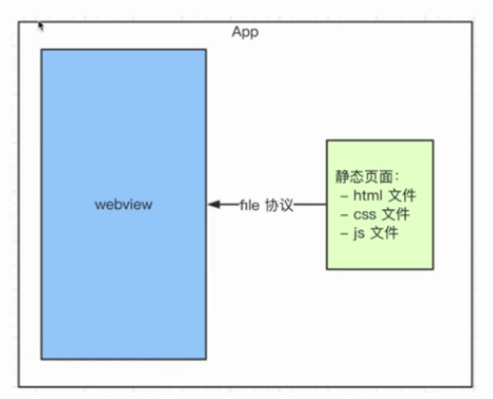
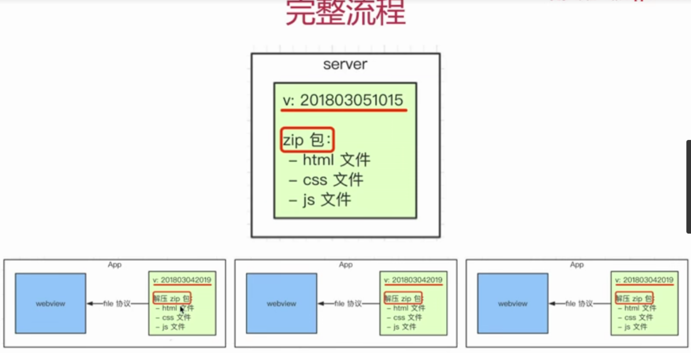
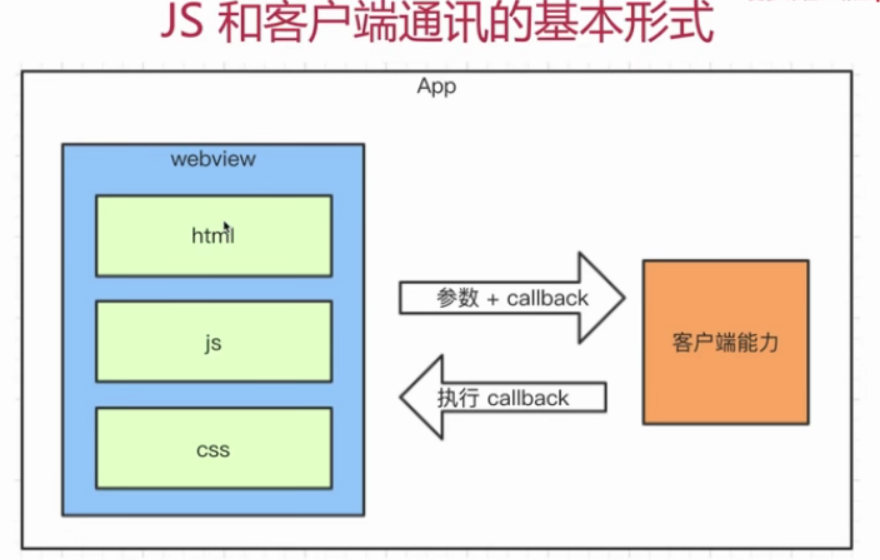
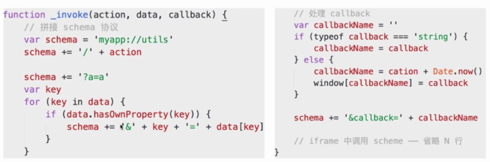
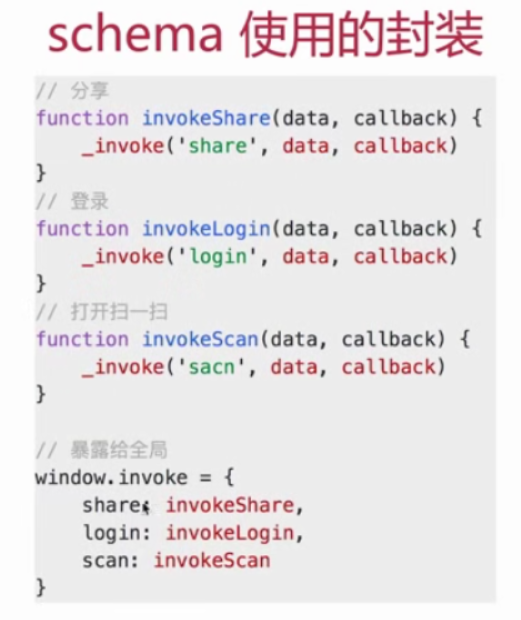

> 移动端占大部分流量，已经远远超过 PC；一线互联网公司都有自己的 APP；这些 APP 中有很大比例的前端代码；拿微信举例，每天浏览的公众号文章小程序等都是前端代码。

# hybrid 是什么，为何用 hybrid？

- 文字解释
  - hybrid 即“混合”，即前端和客户端的混合开发
  - 需前端开发人员和客户端开发人员配合完成
  - 某些环节也可能涉及到 server 端
  - ps：不要以为自己是前端就可以不理会客户端的知识
- 存在价值，为何会用 hybrid
  - 存在的核心意义在于可以快速迭代更新【关键】（无需 app 审核，思考为何？）
  - 体验更流畅（和 native 的体验基本类似）
  - 减少开发和沟通成本，双端公用一套代码
- webview（一类组件的统称）
  - 是 app 中的一个组件（app 可以有 webview，也可以没有）
  - 用于加载 h5 页面，即一个小型的浏览器内核
- file://协议
  - 其实在一开始接触 HTML 开发，就已经使用了 file 协议
  - 只不过你当时没有“协议” 、“标准”等这些概念
  - 再次强调“协议”、“标准”的重要性！！！
  - file 协议：本地文件，快；http(s)协议：网络加载，慢
- 具体实现
  - 不是所有场景都适合使用 hybrid
  - 使用 NA：体验要求极致，变化不频繁（如头条首页）
  - 使用 hybrid：体验要求高，变化频繁（如头条的新闻详情页）
  - 使用 h5：体验无要求，不常用（如举报、反馈等页面）
- hybrid 实现流程
  - 前端做好静态页面（html,js,css）,将文件交给客户端
  - 客户端拿到静态页面，以文件形式存储在 app 中
  - 客户端在一个 wbview 中使用 file 协议加载静态页面
    
- 具体实现之遗留问题
  - app 发布之后，静态文件如何实时更新？
    - 要替换每个客户端的静态文件
    - 只能客户端来做（客户端是我们开发的）
    - 客户端去 server 下载最新的静态文件
    - 我们维护 server 的静态文件
  - 静态页面如何获取内容？
    > 新闻详情页适用 hybrid，前端如何获取新闻内容呢？不能使用 Ajax 获取，第一跨域，第二 速度慢；客户端获取新闻内容（可以提前获取），然后 JS 通讯拿到内容再渲染。看下面 前端 js 和客户端通讯
- hybrid 更新上线流程
  - 分版本，有版本号，如 201803051019
  - 将静态文件压缩成 zip 包，上传到服务端
  - 客户端每次启动，都去服务端检查版本号
  - 如果服务端版本号大于客户端版本号，就去下载最新的 zip 包
  - 下载完之后解压包，然后将现有文件覆盖
    

# 介绍一下 hybrid 更新和上线的流程？

> 看以上内容

# hybrid 和 h5 的主要区别

> hybrid 优点是体验好，可快速迭代；缺点是开发成本高，运维成本高；hybrid 适合产品型，H5 适用于运营型。

# 前端 js 和客户端如何通讯？

- 问题解答
  1. 通讯的基本形式：调用能力，传递参数，监听回调
  2. 对 schema 协议的理解和使用
  3. 调用 schema 代码的封装
  4. 内置上线的好处：更快更安全
- JS 和客户端通讯的基本形式
  - JS 访问客户端能力，传递参数和回调函数
  - 客户端通过回调函数返回内容
    
- schema 协议简介和使用
  - schema 协议——前端和客户端通讯的约定
  ```
  // 下面代码可以发起一个schema的协议
  function invokeScan() {
      window['_invoke_scan_callback_'] = function (result) {
          alert(result)
      }
      var iframe = document.createElement('iframe')
      iframe.style.display = 'none'
      <!-- iframe.src = 'weixin://dl/scan' // 重要 -->
      iframe.src = 'weixin://dl/scan?k1=v1&k2=v2&k3=v3&callback=_invoke_scan_callback_'
      var body = document.body
      body.appendChild(iframe) // 将iframe放进body即发起一个schema的协议
      setTimeout(function(){
          body.removeChild(iframe)
          iframe = null
      })
  }
  document.getElementById('btn').addEventListener('click',function(){
      invokeScan()
  })
  ```
- schema 使用的封装
  ```
  <!-- 封装后可以傻瓜式调用，而且不用再自己定义全局函数 -->
  window.invoke.share({title:'xxx',content:'xxx'},function(result){
      if(result.errno===0) {
          alert('分享成功')
      }else{
          // 分享失败
          alert(result.message)
      }
  })
  ```
  
  
- 内置上线
  - 将以上封装的代码打包叫做 invoke.js，内置到客户端
  - 客户端每次启动 webview，都默认执行 invoke.js
  - 本地加载，免去网络加载的时间，更快
  - 本地加载，没有网络请求，黑客看不到 schema 协议，更安全
