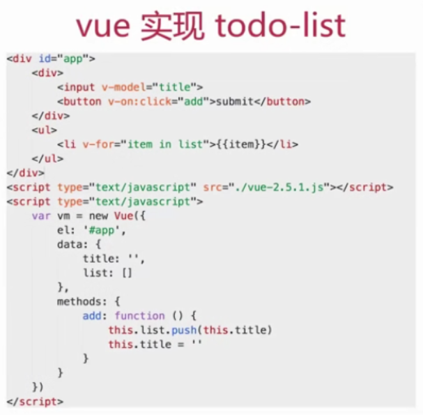
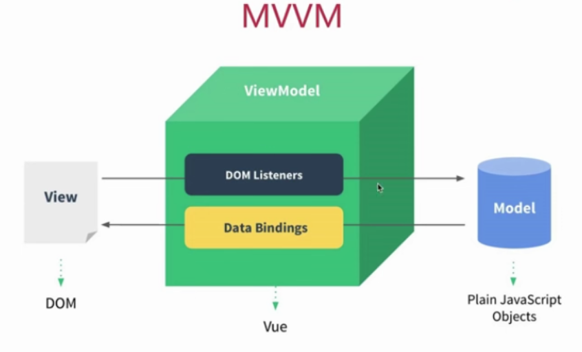

# 如何理解 MVVM

# 如何实现 MVVM

# 是否解读过 vue 的源码

# 说一下使用 jQuery 和使用框架的区别

- 使用 jQuery 实现一个 todo-list
  
- vue 实现 todo-list
  
- jQuery 和框架的区别
  1. 数据和视图的分离，解耦（契合开放封闭原则）
  2. 以数据驱动视图，只关心数据变化，DOM 操作被封装

# 说一下对 MVVM 的理解

- MVC
  > 三者分开、解耦
  - M - Model 数据
  - V - View 视图、界面
  - C - Controller 控制器、逻辑处理
    
- MVVM

  > 所谓 MVVM,即 Model View ViewModel

  - Model-模型、数据
  - View - 视图、模板（视图和模型是分离的）
  - ViewModel - 连接 Model 和 View

  

  > view 通过事件绑定操作 model，model 通过数据绑定操作 view，如下图：

  

- 关于 ViewModel
  - MVVM 不算是一种创新
  - 但其中的 ViewModel 确实是一种创新
  - 真正结合前端场景应用的创建

# MVVM 框架的三大要素（即 vue 的三要素）

1. 响应式： vue 如何监听到 data 的每个属性变化？
2. 模板引擎：vue 的模板如何被解析，指令如何处理？
3. 渲染：vue 的模板如何被渲染成 html?以及渲染过程

# vue 中如何实现响应式

- 什么是响应式

  > 修改 data 属性之后，vue 立刻监听到；data 属性被代理到 vm 上

- Object.defineProperty(实现响应式的核心 API)
- 模拟

# vue 中如何解析模板

# vue 的整个实现流程
