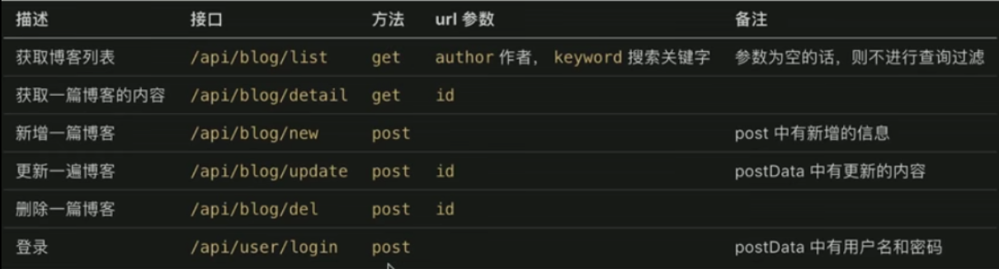

# nodejs 介绍

- 下载&安装

1. 普通方式安装：在 nodejs 官网下载并安装即可
2. nvm 方式安装：nvm,nodejs 版本管理工具，可切换多个 nodejs 版本
   > mac os,使用 brew install nvm；windows,github 中搜索 nvm-windows，有下载地址，下载后安装
   - nvm 的使用
     1. nvm list 查看当前所有的 node 版本
     2. nvm install v10.13.0 安装指定的版本
     3. nvm use --delete-prefix 8.12.0 切换到指定的版本

- nodejs 和前端 js 的区别
  - ECMAScript
    > 只是定义了语法和词法（如：变量定义、循环、判断、函数、原型和原型链、作用域和闭包、异步。不能操作 dom,不能监听 click 事件，不能发送 Ajax 请求，不能处理 HTTP 请求，不能操作文件，即只有 es 几乎做不了任何实际项目），写 js 和 nodejs 都必须遵守。具体可参考阮一峰的 es 网站
  - javascript
    > 使用了 ECMAScript 语法规范，外加 web API（由 www3c 标准定义） ，缺一不可。web API 有 dom 操作，bom 操作，事件绑定，Ajax 等。
    > 两者结合即可完成浏览器端的任何操作
  - nodejs
    > 同前端 js，也是使用了 ECMAScript 语法规范，外加 nodejs API,缺一不可。nodejs API 包含 有处理 http,处理文件等的 API。可参考 nodejs.cn
- nodejs 使用中的 commonjs 模块化
  了解导出引入的语法

  ```
    // a.js文件
    function add (a,b){
        return a+b
    }
    function mul(a,b) {
        return a*b
    }
    // module.exports = add 单个导出
    module.exports = {
        add,
        mul
    }
    // b.js文件
    // const add = require('./a') 单个引入
    const {add,mul} = require('./a') // 多个引入
    const sum = add(10,20)
    console.log(sum)
  ```

- nodejs 使用中的 debugger 的使用
  > 在 vscode 编译器，左侧菜单栏有 debugger 工具，自行调试。。。

# server 开发和前端开发的区别

- server 端开发要考虑的有服务稳定性（用 PM2 做进程守候）、cpu 内存与性能（server 端要承载很多请求，cpu 和内存都是稀缺资源；所以项目使用 stream 写日志以此节省 CPU 和内存，使用 redis 存 session 用于扩展系统 CPU 和内存 ）、日志记录、安全性、集群和服务拆分等方面
- 前端也会参与写日志，但只是日志的发起方，不关心后续
- server 端要记录日志、存储日志、分析日志，前端不关心
- 日志记录方式有多种，根据不同需要进行选择
- server 端要随时准备接受各种恶意攻击，前端则少很多。如越权操作，数据库攻击等。做登录验证，预防 xss 和 sql 注入
- 产品发展速度快流量可能会迅速增加，如何通过扩展机器和服务拆分来承载大流量？课程虽然是单机器开发，但是从设计上支持服务拆分

# 博客项目介绍

## 目标

1.  开发一个博客系统，具有博客的基本功能

2.  只开发 server 端，不关心前端

## 需求

1. 首页、作者主页、博客详情页
2. 登录页
3. 管理中心、新建页、编辑页

## 技术方案

### 数据如何存储

1. 博客存储（id、标题、内容、创建时间、作者）
2. 用户存储（id、用户名、密码、真实姓名）

### 如何与前端对接，即接口设计



# 开发接口（不用任何框架）

1. nodejs 处理 http 请求

   - http 请求概述（浏览器输入地址到页面展示的过程）:

     1. DNS 解析，（找到 IP 地址然后）建立 TCP 连接，（TCP 三次握手之后）发送 http 请求
     2. server 接收到 http 请求，处理，并返回
     3. 客户端接收到返回数据，处理数据（如渲染页面，执行 js）

   - nodejs 处理 http 请求
     1. get 请求和 querystring
        > get 请求，即客户端要向 server 端获取数据，如查询博客列表；通过 querystring 来传递数据，如 a.html?a=100&b=200；浏览器直接访问，就发送 get 请求。
     2. post 请求和 postdata
        > post 请求，即客户端要向服务端传递数据，如新建博客；通过 post data 传递数据。
     3. 路由（即接口地址）

2. 搭建开发环境
   - 从 0 开始搭建，不使用任何框架
   - 使用 nodemon 监测文件变化，自动重启 node
   - 使用 cross-env 工具设置环境变量，这个工具兼容 mac linux 和 Windows
   - 新建 app.js 和 www.js 分别写入基本服务代码和服务配置
3. 开发接口（暂不连接数据库，暂不考虑登录）
   - 初始化路由：根据之前技术方案的设计做出路由
   - 返回假数据：将路由和数据处理分离，以符合设计原则
   - 第一层 www.js， 第二层 app.js， 第三层 router 路由，第四层 controller 数据处理层（层次的拆分取决于系统复杂度，也有可能拆分出更多的层次）

# 路由和 API

- API：前端和后端、不同端（子系统）之间对接的一个术语（url（路由）`/api/blog/list`get.输入，输出）

- 路由：API 的一部分，后端系统内部的一个定义

# 数据存储

# mysql 介绍、安装和使用

> MySQL 是企业内最常用的存储工具，一般都有专人运维，MySQL 也是社区内最常用的存储工具，有问题可以随时查资料，MySQL 本身是一个复杂的数据库软件，本项目只了解基本使用；是 web server 中最流行的关系型数据库；官网课免费下载用于学习；轻量级易学易用

1. 执行安装
2. 过程中需要输入 root 用户名的密码，要记住这个密码
3. 安装 MySQL workbench，用于操作 MySQL 的客户端，可视化操作

# nodejs 操作 mysql

mysql 忘记密码解决方案：https://blog.csdn.net/weidong_y/article/details/80493743

1. 示例：用 demo 演示，不考虑使用

```
<!-- index.js/app.js代码示例 -->
<!-- 先安装mysql npm i mysql -->
const mysql = require("mysql")
// 创建连接对象
const con = mysql.createConnection({
  host:"localhost",
  user:"root",
  password:"12345678",
  port:"3306",
  database:"blogServer"
})
// 开始连接
con.connect()
// 执行sql语句
const sql = "select * from users"
con.query(sql,(err,result)=>{
  if(err){
    console.error(err)
    return
  }
  console.log(result)
})
// 关闭连接
con.end()
```

2. 封装：将其封装为系统可用的工具

```
<!-- 先安装mysql npm i mysql -->
<!-- src下新建conf文件夹，conf文件夹下新建db.js文件,内容如下 -->
const env = process.env.NODE_ENV // 获取环境变量参数
// 配置
let MYSQL_CONF
if(env==="dev") {
  MYSQL_CONF={
    host:"localhost",
    user:"root",
    password:"12345678",
    port:"3306",
    database:"blogServer"
  }
}
if(env==="production") {
  MYSQL_CONF = {
    host:"localhost",
    user:"root",
    password:"12345678",
    port:"3306",
    database:"blogServer"
  }
}
module.exports = {
  MYSQL_CONF
}
```

```
<!-- src下新建db文件夹，db文件夹(存放与数据操作有关的文件)下新建mysql.js文件,内容如下 -->
```

3. 使用：让 API 直接操作数据库，不再使用假数据

- API 对接 mysql

# 登录

> 核心：登录校验&登录信息存储

## cookie 和 session 是实现登录的必要条件和解决方案

1. 什么是 cookie
   > 存储在浏览器的一段字符串（最大 5kb）；跨域不共享；格式如 k1=v1;k2=v2;k3=v3;因此可以存储结构化数据；
   > 每次发送 http 请求，会将请求域的 cookie 一起发送给 server;
   > server 可以修改 cookie 并返回给浏览器;
   > 浏览器中也可以通过 JavaScript 修改 cookie（有限制）
2. javascript 操作 cookie，浏览器中查看 cookie
3. server 端（nodejs）操作 cookie，实现登录验证
   - 查看 cookie
   ```
   <!-- app.js中 -->
   const cookieStr = req.headers.cookie || "";
   <!-- router下的文件中  登陆成功的回调函数中-->
   res.setHeader('Set-Cookie', username=${data.username}; path=/; httpOnly)
   // 通过设置httpOnly限制客户端对cookie的修改
   ```
   - 修改 cookie
   - 实现登录验证
     > 用以上 cookie 的方式做登录验证存在一些问题如会暴露 username，很危险，如何解决：cookie 中存储 userid,server 端对应 username；即 server 端存储用户信息

## session 写入 redis

- session 的问题
  1. 目前 session 直接是 jd 变量，放在 nodejs 进程中
  2. 第一，进程内存有限，访问量过大，内存暴增怎么办
  3. 第二，正式线上运行是多进程，进程之间内存无法共享
- 解决方案 redis
  1. web server 最常用的缓存数据库，数据存放在内存中
  2. 相比于 MySQL，访问速度快
  3. 但是成本更高，可存储的数据量更小
     > 将 web server 和 redis 拆分为两个单独的服务，双方都是独立的，都是可扩展的（例如都扩展成集群），MySQL 也一样
- 为什么 session 适合用 redis
  1. session 访问频繁，对性能要求极高
  2. session 可不考虑断电丢失数据的问题（内存的硬伤）
  3. session 数据量不会太大（相比于 MySQL 中存储的数据）
- 为什么网站数据不适合用 redis？
  1. 操作频率不是太高（相比于 session 操作）
  2. 断电不能丢失，必须保留

### nodejs 连接 redis

```
首先 npm i redis 安装
app/index.js 引入
const redis = require("redis")
// 创建客户端
const redisClient = redis.createClient(6379,'127.0.0.1')
redisClient.on('error',err=>{
console.error(err)
})
// 测试
redisClient.set('myname','zhangsan2',redis.print)
redisClient.get('myname',(err,val)=>{
  if(err) {
    console.error(err)
    return
  }
  console.log('val ',val)
  // 退出
  redisClient.quit()
})
```

### nodejs 连接 redis 封装成工具

## 开发登录功能，和前端联调（用到 nginx 反向代理）

- 登录功能依赖 cookie，必须用浏览器来联调
- cookie 跨域不共享，前端和 server 端必须同域
- 需要用到 nignx 做代理，让前后端同域

1. 首先开发一个前端页面
