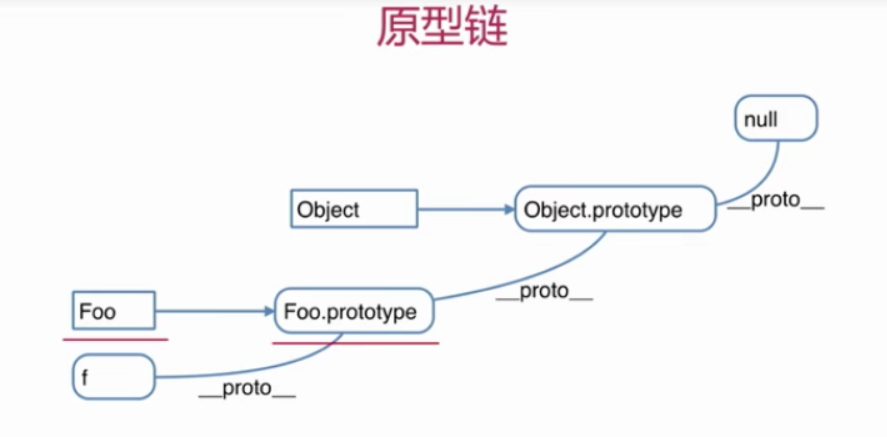

# 题目

## 如何准确判断一个变量是数组类型

arr instanceof Array // 返回 true 则是数组类型

## 写一个原型链继承的例子

```
function Animal(name,age){
    this.name = name
    this.age = age
    this.eat = function(){
        console.log('animal eat')
    }
}
function Dog(){
    this.bark = function(){
        console.log('dog bark')
    }
}
Dog.prototype = new Animal()
var hashiqi = new Dog()
```

> 贴近实战的原型实例

```
function Elem(id){
    this.elem=document.getElementById(id)

}
Elem.prototype.html = function(val) {
    var elem = this.elem
    if(val){
        elem.innerHTML = val
        return this // 链式操作
    }else{
        retun elem.innerHTML
    }
}
Elem.prototype.on = function(type,fn) {
    var elem = this.elem
    elem.addEventListener(type,fn)
    return this // 链式操作
}
var div1 = new Elem('div1')
console.log(div1.html())
div1.on('click',function(){
    alert('clicked')
})
```

## 描述 new 一个对象的过程

- 创建一个新对象
- this 指向这个新对象
- 执行代码，即对 this 赋值
- 返回 this

## zepto(或其他框架)源码中如何使用原型链

# 知识点

## 构造函数

```
function Foo(name,age){
    this.name=name;
    this.age=age;
    this.class='class-1'
    // return this // 默认有这一行
}
var f=new Foo('ls',20)
```

## 构造函数 —— 扩展

> 所有的引用类型都有构造函数

- var a = {} 其实是 var a = new Object()的语法糖
- var a = [] 其实是 var a = new Array()的语法糖
- function Foo(){...}其实是 var Foo = new Function(...)

> 使用 instanceof 判断一个函数是否是一个变量的构造函数

## 原型规则和示例

- 所有的引用类型（数组、对象、函数），都具有对象特性，即可自由扩展属性（除了‘null’以外）

```
var obj = {}; obj.a=100
var arr = []; arr.a=100
function() fn{}
fn.a=100
```

- 所有的引用类型（数组、对象、函数），都有**proto**（隐式原型）属性，属性值是一个普通对象

```
console.log(obj.__proto__)
console.log(arr.__proto__)
console.log(fn.__proto__)
```

- 所有的函数，都有一个 prototype（显式原型）属性，属性值也是一个普通对象

```
console.log(fn.prototype)
```

- 所有的引用类型（数组、对象、函数），**proto**属性值指向它的构造函数的 prototype 属性值

```
console.log(obj.__proto__ === Object.prototype)
```

- 当试图得到一个对象的某一个属性时，如果这个对象本身没有这个属性，那么会去它的**proto**（即它的构造函数的 prototype）中寻找

循环对象自身的属性:

```
var item
for(item in f) {
    // 高级浏览器已经在for in 中屏蔽了来自原型的属性
    // 但是这里建议加上下面的这个判断，保证程序的健壮性
    if(f.hasOwnProperty(item)){ // 判断是否是f自身的属性
        console.log(item)
    }
}
```

## 原型链



## instanceof

- f instanceof Foo 的判断逻辑是：
- f 的**proto**一层一层往上，能否对应到 Foo.prototype
- 再试着判断 f instanceof Object

# 原型知识趁热打铁

## 题目

### 说一下原型的实际应用

1. jquery 和 zepto 的简单使用
2. zepto 如何使用原型
   ···
   var $p = $('p')
   $p.css('color', 'red') // css 是原型方法
   console.log($p.html()) // html 是原型方法

   var $div1 = $('#div1')
   $div1.css('color','blue') // css 是原型方法
   console.log($div1.html()) // html 是原型方法
   ···

3. jquery 如何使用原型

### 原型如何体现它的扩展性
