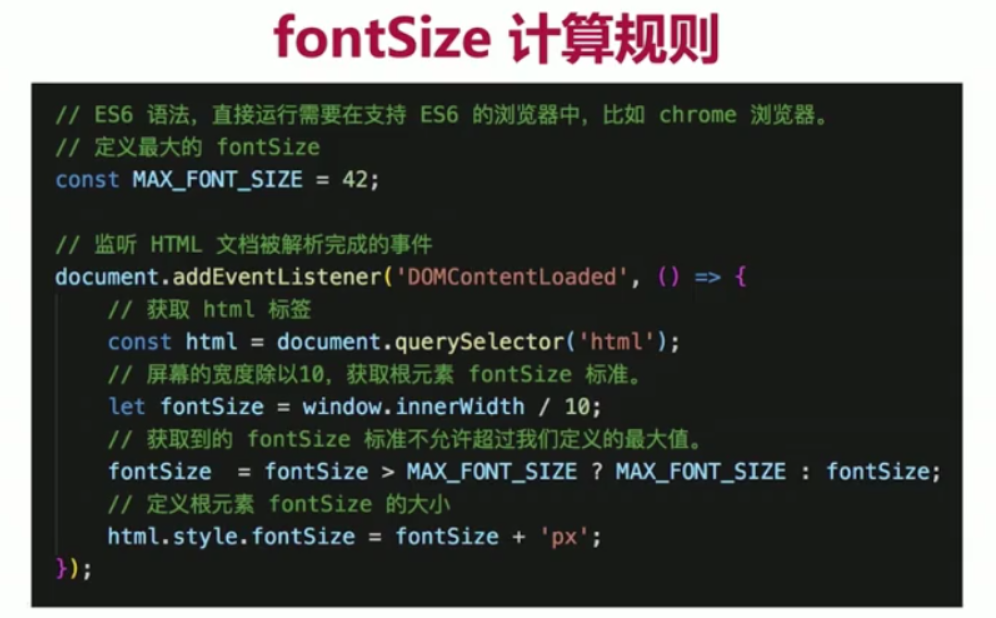
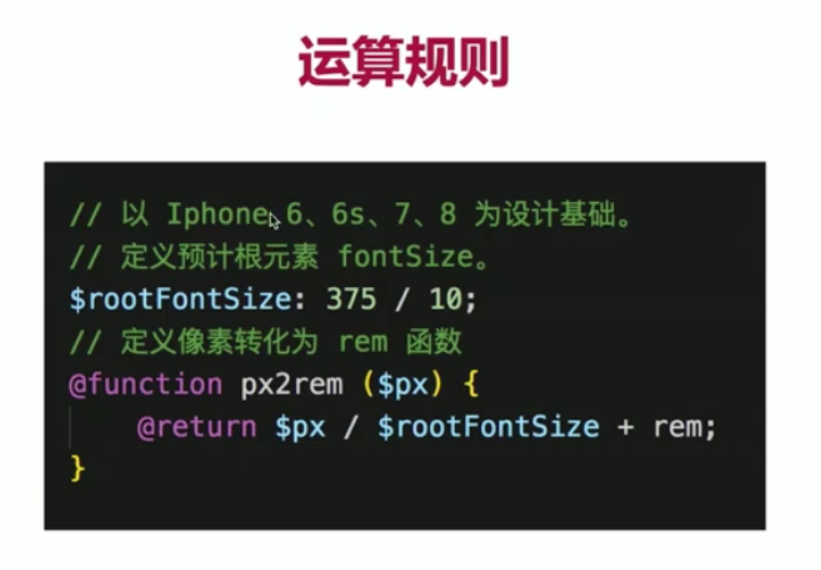

# 现有的混合开发方案

- React、ReactNative
- weex
- Flutter
- 小程序开发
- 移动应用混合开发框架
- PWA

> 面对如此众多的开发方案，我们不必纠结学习哪些，而是要究其本质从原理入手，研究 vue 或者其他框架配合 Android、IOS 的跨语言通讯原理
# 课程收获

- 前端技术开发
- 混合开发的核心原理和跨语言通讯机制
- 前端项目的服务器部署

# 什么是混合开发

- hybrid APP,混合了 Native（原生）技术和 web 技术进行开发的移动应用

# 流行的混合开发方案

1. 基于 webview UI(JSBridge),如淘宝、微信。
2. 基于 Native UI（运用 ReactNative、weex）
3. 小程序方案（微信、支付宝小程序），是基于 JSBridge 的。
   > 事实上 2、3 方式都是基于方案 1 的 JSBridge 进行了不同程度的封装等。

- hybrid app 本质
  > 在原生 APP 中，使用 webview 作为容器，来承载一个 web 页面
- hybrid app 核心
  > 原生（Native）和 web 端的双向通讯层（跨语言解决方案）:JSBridge(定义：一座用 JavaScript 搭建起来的桥，一端是 web，一端是 Native；目的：让 Native 可以调用 web 的 JavaScript 代码，让 web 可以调用 Native 的原生代码)

# Android 与 web(js) 通讯

> 原生工程师完成 webview 布局，并且通过 webview 构建 JSBridge 对象，（原生端提供的 JSBridge 字符串会被挂载到网页中的 window 对象下面。Android 端只能接收基本数据类型参数，不能接收引用类型的参数。如果数据是引用类型（object、array）使用 JSON.stringfy 转为字符串）然后提供调用文档给 web 端，web 端根据文档来完成双方的互相调用。原生端调用 web 端方法，方法必须是挂载到 web 端 window 对象下面的方法。

# 流程

1. Android Studio 环境配置
   1. JDK 安装（1.8 以上）
   2. 环境变量配置（只针对 Windows 用户）
   3. Android Studio 下载
2. vscode 新建 web 项目文件夹，在文件夹中新建 index.html
3. 给 Android 提供访问 web 端的地址
   1. 安装 npm 和 http-server(npm i http-server -g)
   2. 安装完 http-server 后，在 web 项目下启动 http-server（控制台直接输入 http-server）（window 10 使用 http-server 会有问题，可以换用 anywhere 插件）
   3. 访问启动服务后得到的地址，就可以访问到 index.html 文件了
   4. 把 web 网页的访问地址放到 Android 端代码的 WEB_URL 处。
   5. 在 Android9.0 的设备上，如果需要加载 http 协议的网页，那么需要对 app 进行安全访问设置。（在 Android 端代码的配置文件中进行配置即可）
4. Android 与 web(js) 通讯示例

   ```
   // web端调用Android端代码
   <input type="button" value="调用 androidTestFunction1" onclick="toAndroidFunction1()"/>
   <input type="button" value="调用 androidTestFunction1" onclick="toAndroidFunction2()"/>
   <script>
        function toAndroidFunction1 () {
            window.AndroidJSBridge.androidTestFunction1('调用 android 下的Function1方法')
        }
        function toAndroidFunction2 () {
            var result = window.AndroidJSBridge.androidTestFunction2();
            alert(result)
        }
   </script>
   ```

   ```
   // Android端调用web端代码
    <script>
       // Android端会调用onFunction方法
        window.onFunction = function(str) {
            alert(str);
            return '这是onFunction方法的返回值'
        }
   </script>
   ```

5. IOS 的代码运行
   1. 必须使用 macos 系统
   2. 安装 Xcode 编译器
   3. 与 Android 不同，IOS 可以直接接收一个对象数据
6. Android、IOS 的双向通讯对比
   - 相同点
     1. 都是通过 webview 来完成网页的加载
     2. 都是通过向 window 注入对象的方式来提供可被 web 端调用的方法
     3. 都可以直接调用 web 端挂载到 window 对象下的方法
   - 不同点
     1. 注入对象不同：Android 可提供注入对象名。IOS 固定为 webkit
     2. JS 调用 Native 方式不同：面向 Android 可直接获取注入对象，调用方法。面向 IOS 为相对固定写法（window.webkit.messageHandles.方法名.postMessage（入参对象））
     3. 传递数据格式不同：面向 Android 只能接受基本数据类型的数据；面向 IOS 可以接受任意类型数据。
     4. 返回值不同：面向 Android 可以直接接收返回值。面向 IOS 没有办法直接获取返回值。

# 基本知识使用

- flex 布局

  - 目的：为盒状模型提供灵活性
  - display:flex/-webkit-flex;
  - 采用 Flex 布局的元素，称为容器。它的所有子元素自动成为容器成员，称为项目。
  - 代码示例

    ```
    <div class="box">
        <div class="sub">1</div>
        <div class="sub">2</div>
        <div class="sub">3</div>
        <div class="sub">4</div>
    </div>
    <style>
        // flex容器属性
        .box{
            display:flex;
            display:-webkit-flex; // 适配webkit内核浏览器
            flex-direction:row;// 四个值 row(左到右，默认值)、row-reverse(右到左)、column(上到下)、column-reverse(下到上) 主轴根据flex-direction值而定。
            // nowrap(默认值，不换行，项目太多时项目的宽度会为了适配主轴的宽度而自动缩小)
            // wrap当项目大小超过主轴大小，会自动换行
            // wrap-reverse，同样会换行，但方向会沿着交叉轴相反的方向换行
            flex-wrap: nowrap;
            // flex-start 从主轴的起点开始排列；flex-end：从主轴的终点开始排列；center：主轴方向居中；
            // space-between，在主轴两端对齐排列，项目之间的间距一致；space-around,所有项目两侧的间距都一致。
            justify-content: flex-start; // 决定主轴
            // flex-start沿着交叉轴起点排列；flex-end沿着交叉轴终点排列；center沿着交叉轴中心线排列；baseline沿着项目内第一行文字的基线进行对齐；
            // strech当宽度或者高度没有设置时，会自动纵向或者横向填满容器（终向还是横向看交叉轴的方向即flex-direction的值）
            align-items: flex-start; // 决定交叉轴
        }
        // flex 项目属性
        // order：项目在容器中的排列顺序，数值越小排名越靠前。
        // flex-grow：通过一个数值来定义项目的放大比例，默认为0，即存在剩余空间也不进行放大。align-self：使一个项目与其他项目在交叉轴上拥有不同的对齐方式。
        .sub {
            order: 1;
            flex-grow: 0;
            align-self: auto; // auto，继承父容器属性；其他属性值和align-items的一样
        }
    </style>
    ```

- SCSS 预处理器
  > SCSS 是 SASS3.0 之后的称呼，强化 CSS 的辅助工具，在 css 的语法上增加了额外的功能（嵌套、变量、运算、函数...）
  - 嵌套
    ```
    // 对css选择器的嵌套
    <div class="box">
        <p class="box-desc">测试scss效果</p>
    </div>
    <style>
        .box{
            background-color: blue;
            p {
                color: red;
            }
            &-desc {
                // & === .box
                font-size: 32px;
            }
        }
    </style>
    ```
  - SCSS 变量
    > 用来存储 CSS 中的变量信息
    ```
    <style>
        $titleSize: 32px;
        .box{
            background-color: blue;
            p {
                color: red;
            }
            &-desc {
                // & === .box
                font-size: $titleSize;
            }
        }
    </style>
    ```
  - SCSS 函数与运算
    > 自定义函数，用来计算想要的结果
    ```
    <style>
        // 函数中的变量用$标记，关键词用@标记
        @function doublePx($px) {
            @return $px*2+px;
        }
        $titleSize: doublePx(16);
        .box{
            background-color: blue;
            p {
                color: red;
            }
            &-desc {
                // & === .box
                font-size: $titleSize;
            }
        }
    </style>
    ```
- webpack 模块打包器
  > js 应用程序的静态模块打包器，作用是把开发时的多个模块合并成一个或者指定的几个文件
- vue/cli3 脚手架
  > 基于 webpack 构建，带有基础 webpack 配置的脚手架工具。
- rem

  > 计算场景的目标：定义相同的文字大小，但在不同的应用设备上应该展示不同的像素数
  > 解决办法——rem：相对于<html>标签元素 fontSize 大小的单位

  1. 根据屏幕的宽度定义根元素 fontSize 的大小

  
  在 main.js 中引入

  2. 定义函数把像素转化为 rem

  

  3. 引入初始化样式文件 reset.scss

  

  4. 创建 style.scss 文件

  ```
  // style.scss文件内容
  @import './dimens.scss'
  @import './reset.css'
  ```
