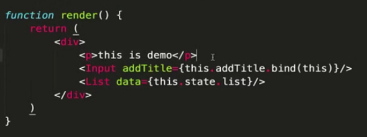
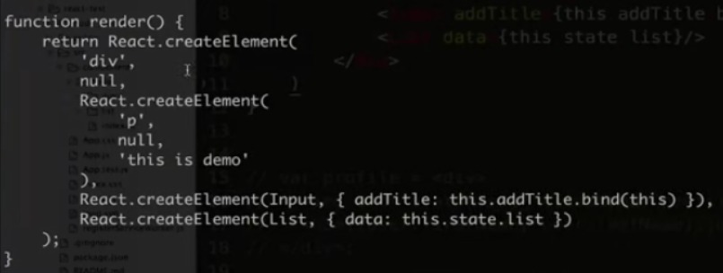
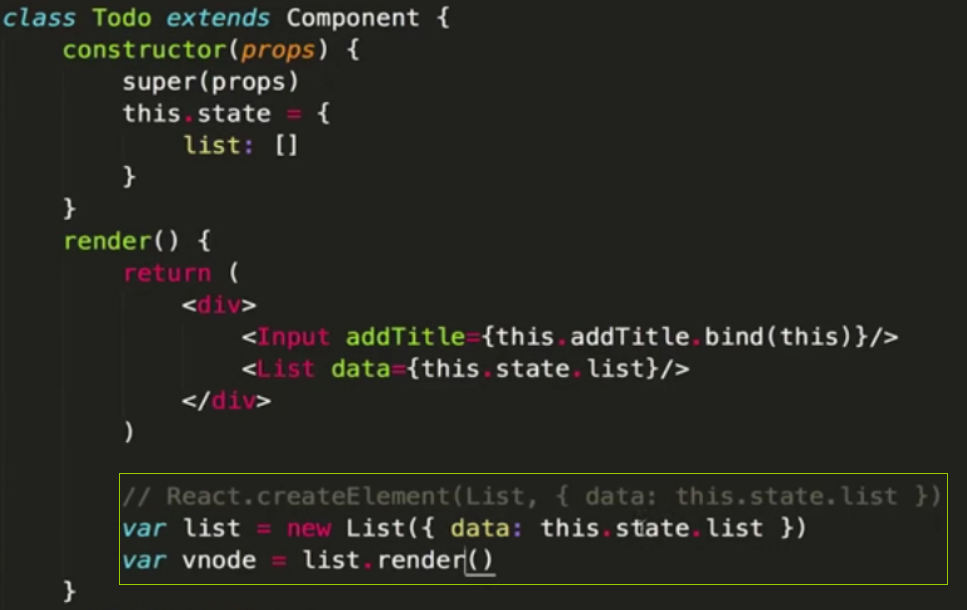

# 是否做过 React 开发

- 实现 react-todo-list

  ```
    // App.js内容
    import Todo from './components/todo/index.js'
    class App extends Component {
        render(){
            return (
                <div>
                    <Todo />
                </div>
            )
        }
    }
    export default App
    //  c omponents->todo->index.js文件内容
    import React, {Component} from 'react'
    import List from ' ./list/index.js'
    import Input from './input/index.js'
    class Todo extendes Component {
        constructor(props) {
            super(props)
            this.state = {
                list: []
            }
        }
        render() {
            return (
                <div>
                    <Input assTitle={this.addTitle.bind(this)} />
                    <List data={this.state.list} />
                </div>
            )
        }
        addTitle(title) {
            const currentList = this.state.list;
            this.setState({
                list:currentList.concat(title)
            })
        }
    }
    export default Todo
    // input组件内容
    import React, {Component} from 'react'
    class Input extendes Component {
        constructor(props) {
            super(props)
            this.state = {
                title:''
            }
        }
        render() {
            return (
                <div>
                    <input value={this.state.title} onChange = {this.changeHandle.bind(this)} />
                    <button onClick={this.clickHandle.bind(this)}>submit</button>
                </div>
            )
        }
        changeHandle(event) {
            this.setState({
                title: event.target.value
            })
        },
        clickHandle() {
            const title = this.state.title
            // 把title添加进列表
            const addTitle = this.props.addTitle
            addTitle(title) // 重点
            // 清空title
            this.setState({
                title: ''
            })
        }
    }
    export default Input
    // list组件内容
    import React, {Component} from 'react'
    class List extendes Component {
        constructor(props) {
            super(props)
        }
        render() {
            const list = this.props.data
            return (
                <ul>
                    {
                        list.map((item,index)=>{
                            return <li key={index}>{item}</li>
                        })
                    }
                </ul>
            )
        }
    }
    export default List

  ```

# React 以及组件化的一些核心概念

# 实现流程

# 说一下对组件化的理解

- 组件的封装
  - 封装视图
  - 数据
  - 变化逻辑（数据驱动视图变化）
- 组件的复用
  - props 传递
  - 复用（传递不同的 data，显示不同的视图数据）

# JSX 的本质是什么

> JSX 其实是语法糖，开发环境会将 JSX 编译成 JS 代码；JSX 的写法大大降低了学习成本和编码工作量；同时，JSX 也会增加 debug 成本 。

- JSX 语法
  - html 形式
  - 引入 js 变量和表达式
    {}中可以写 js 变量或者 js 表达式
    ```
    render() {
        const name = 'zs';
        const show = true; // 标识是否显示img标签
        return ({
            <div>
                {/*<Todo />*/}
                <p>{name ? '1' : 0}</p> // 1
                <p>{name || 'ls'}</p> // true
                <p>{(name ==='zs').toString()}</p> // true
                {show ?  : ''}
            </div>
        })
    }
    ```
  - if...else...
  - 循环
    ```
    render() {
        const list = [1,2,3,4,5]
        return ({
            <div>
                <ul>
                    {list.map((item,index)=>{
                        return <li key={index}>{item}</li>
                    })}
                </ul>
            </div>
        })
    }
    ```
  - style 和 className
    ```
    render() {
        const styleConfig = {
            fontSize:'40px',
            color: 'blue'
        }
        return ({
            <div className="container">
                <p style={styleConfig}>this is a p</p>
                <p style={ {fontSize:'40px',color:'red'}}>this is another p</p>
            </div>
        })
    }
    ```
  - 事件
  - JSX 中的注释：
    ```
    {/_要被注释的标签_/}
    ```
- JSX 解析成 JS

  - 以上的 JSX 语法无法被浏览器解析
  - 那么它是如何在浏览器运行的？
    ```
    // JSX 需要先被解析成 JS才能被浏览器解析，如：
    // JSX代码:
    var profile = <div>
                    
                    <h3>{[user.firstName,user.lastName].join(' ')}</h3>
                  </div>;
    // 解析结果
    var profile = React.createElement("div",null,
        React.createElement("img",{src:"avatar.png", className:"profile"}),
        React.createElement("h3",null,[user.firstName,user.lastName].join(" "))
    );
    // React.createElement（相当于vdom中的h函数/vue中的_c函数）参数说明
    // 依次是标签名、属性、子节点；子节点可以是数组形式也可以不是数组形式
    React.createElement('div',{id:'div1'}, child1, child2, child3)
    React.createElement('div',{id:'div1'},[...])
    ```

- JSX 成为独立的标准
  - JSX 是 React 引入的，但不是 React 独有的（在其他框架中也可以引用）
  - React 已经将它作为一个独立标准开放，其他项目也可用（直接在 xxx.jsx 文件中写 JSX 语法，然后使用 Babel 编译）
  - React.createElement 是可以自定义修改的
  - 说明：本身功能已经完备；和其他标准兼容，扩展性没问题

# JSX 和 vdom 的关系

- 分析：为何需要 vdom
  > vdom 是 React 初次推广开来的，结合 JSX；JSX 就是模板，最终要渲染成 html；初次渲染+修改 state 后的 re-render；正好符合 vdom 的应用场景。
- React.createElement 和 h
  二者返回的都是 vnode；不同的是 h 函数第一个参数是字符串形式的标签名，React.createElement 函数第一个参数有可能是自定义组件的构造函数
  
- 何时 patch
  > ReactDOM.render(...)和 setState
  - 初次渲染-ReactDOM.render(<App/>,container)，会触发 patch(container,vnode)
  - re-render-setState,setState 时会触发 patch(vnode,newVnode)
- 自定义组件的解析

  > 自定义组件解析时传入的第一个参数是构造函数

  
  

  - 第一个参数'div'-直接渲染<div>即可，vdom 可以做到
  - Input 和 List，是自定义组件（class），vdom 默认不认识
  - 因此 Input 和 List 定义的时候必须声明 render 函数
  - 根据 props 初始化实例，然后执行实例的 render 函数
  - render 函数返回的还是 vnode 对象
    > 先初始化实例然后触发 render 函数
    > 

# 说一下 setState 的过程

- setState 是异步的

  ```
  addTitle(title) {
      const currentList = this.state.list
      console.log(this.state.list) // ['a','b']
      this.setState({
          list: currentList.concat(title) // 'c'
      })
      console.log(this.state.list) // ['a','b'] 说明setState是异步的

      this.setState({
          list: currentList.concat(title) // 'c'
      },()=>{
          // 这个回调函数只是一个模拟实现
          console.log(this.state.list) // ['a','b','c']
          this.renderComponent() // setState最终会执行Component构造函数中的renderComponent方法重新渲染页面
      })
  }
  ```

- setState 为何需要异步
  - 可能会一次执行多次 setState
  - 无法确定、限制用户如何让使用 setState
  - 没必要每次 setState 都重新渲染，考虑性能
  - 即使是每次重新渲染，用户也看不到中间的效果
  - 只看到最后的结果就行
- vue 修改属性也是异步
  - 效果、原因和 setState 一样
  - set 中执行 updateComponent 这一步是异步的。
- setState 的过程
  - 每个组件实例都有 renderComponent 方法
  - 执行 renderComponent 会重新执行实例的 render
  - render 函数返回 newVnode，然后拿到 preVnode
  - 执行 patch(preVnode,newVnode)

# 阐述自己对 React 和 vue 的认识

> 技术选型没有绝对的对与错，技术选型要考虑的因素非常多。国内使用首推 vue，文档易读易学社区够大。如果团队水平较高，推荐使用 React，组件化和 JS 是优势。

- 两者的本质区别
  - vue 本质是 MVVM 框架，由 MVC 发展而来
  - React 本质是前端组件化框架，由后端组件化发展而来
  - 这并不妨碍他们两者都能实现相同的功能
  - 模板的区别
    - vue 使用模板（最初由 angular 提出）
    - React 使用 JSX
    - 模板语法上，更倾向于 JSX（JSX 已标准化）
    - 模板分离上，更倾向于 vue（可以看到 react 的 render 函数中，模板和 js 混在一期未分离）
- 看模板和组件化的区别
  - react 本身就是组件化，没有组件化就不是 react
  - vue 也支持组件化（最最初的 vue 雏形没有组件化），不过它 是在 MVVM 上的扩展
- 两者的共同点
  - 都支持组件化
  - 都是数据驱动视图
