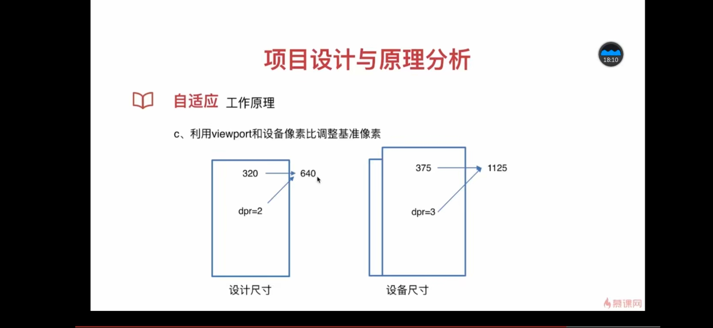

# 基础 css 部分

1. 定义规范(stylus)

```
variable.styl文件
// 颜色定义规范
$color-background = #222
$color-background-d = rgba(0, 0, 0, 0.3)
$color-highlight-background = #333
$color-dialog-background = #666
$color-theme = #ffcd32
$color-theme-d = rgba(255, 205, 49, 0.5)
$color-sub-theme = #d93f30
$color-text = #fff
$color-text-d = rgba(255, 255, 255, 0.3)
$color-text-l = rgba(255, 255, 255, 0.5)
$color-text-ll = rgba(255, 255, 255, 0.8)

//字体定义规范
$font-size-small-s = 10px
$font-size-small = 12px
$font-size-medium = 14px
$font-size-medium-x = 16px
$font-size-large = 18px
$font-size-large-x = 22px
```

```
base.styl文件
@import "variable.styl"
@import "variable.styl"

body, html
  line-height: 1
  font-family: 'PingFang SC', 'STHeitiSC-Light', 'Helvetica-Light', arial, sans-serif, 'Droid Sans Fallback'
  user-select: none
  -webkit-tap-highlight-color: transparent
  background: $color-background
  color: $color-text
```

2.使用 mixin 定义一些函数在需要的时候引入

```
mixin.styl文件
// 背景图片
bg-image($url)
  background-image: url($url + "@2x.png")
  @media (-webkit-min-device-pixel-ratio: 3),(min-device-pixel-ratio: 3)
    background-image: url($url + "@3x.png")

// 不换行
no-wrap()
  text-overflow: ellipsis
  overflow: hidden
  white-space: nowrap

// 扩展点击区域
extend-click()
  position: relative
  &:before
    content: ''
    position: absolute
    top: -10px
    left: -10px
    right: -10px
    bottom: -10px
```

# 自适应

1. 基本概念
   a. css 像素、设备像素、逻辑像素、设备像素比

   > css 像素即平时在 css 中写的像素（px）,逻辑像素即 css 像素；设备像素：手机上一个像素点就是一个物理像素点，这个是物理像素，但苹果的 retina 屏如果像素比是 2，那么手机上的一个逻辑像素（css 像素）需要两个设备（物理）像素点来表示，即 css 的 1px 等于 2 个像素点。设备像素比是 css 像素/物理像素的比值。

   b. viewport

   > viewport 分三类：layout viewport （一张 html 的大图）、 visual viewport（手机屏幕可视的区域在 layout viewport 上裁剪给用户可见的区域） 、ideal viewport（手机屏幕可视的区域）；
   > width=device-width 让 layout viewport=ideal viewport

   c. rem

   > rem 即 fontsize of the root element
   > 1rem=根元素字体大小（chrome 下默认 16px）
   > 字体单位——值根据 html 根元素大小而定，可以作为宽度，高度等单位
   > 适配原理——把 px 替换成 rem，动态修改 html 的 font-size 的值进行适配
   > 兼容性——Ios6 以上和 android2.1 以上，基本覆盖所有流行的手机系统
   > em 是相对于父元素而 rem 是相对于 html 根元素的

2. 工作原理
   a. 利用 viewport 和设备像素比调整基准像素
   
   320、375 指的是 css 像素，dpr 是设别像素比，两者相乘是物理像素 640、1125，即手机硬件提供了 640、1125 个像素点（横向，这里暂不考虑纵向）
   b. 利用 px2rem 自动转换 css 单位

# 页面入口+header 组件的编写

> 布局仍可以用浮动

1. index.html 视口设置

```
<!DOCTYPE html>
<html>
  <head>
    <meta charset="utf-8">
    <meta name="viewport"
          content="width=device-width, initial-scale=1.0, maximum-scale=1.0, minimum-scale=1.0, user-scalable=no">
    <title>vue-music</title>
  </head>
  <body>
    <div id="app"></div>
    <!-- built files will be auto injected -->
  </body>
</html>
```

2. 安装了 babel-runtime、babel-polyfill 对语法做编译转义；安装 fastclick 解决移动端的点击 300ms 延迟的问题。（main.js 中引入了 babel-polyfill 和 fastclick）

```
<!-- main.js代码示例 -->
import 'babel-polyfill'
import Vue from 'vue'
import App from './App'
import router from './router'
import fastclick from 'fastclick'
import VueLazyload from 'vue-lazyload'
import store from './store'

import 'common/stylus/index.styl'

/* eslint-disable no-unused-vars */
// import vConsole from 'vconsole'

fastclick.attach(document.body)

Vue.use(VueLazyload, {
  loading: require('common/image/default.png')
})

/* eslint-disable no-new */
new Vue({
  el: '#app',
  router,
  store,
  render: h => h(App)
})

```
